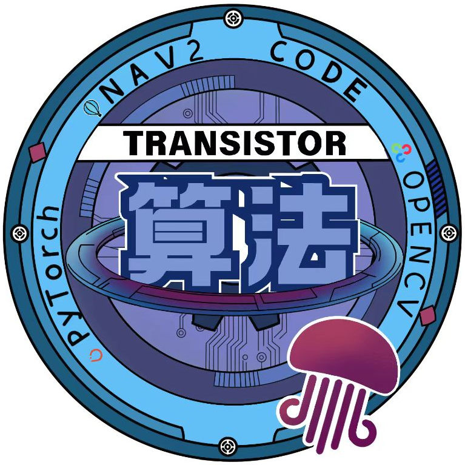

# 北航Transistor战队rmua2026

<div style="text-align: center;">
  
</div>

本仓库用来协作开发rmua2026的无人机自主导航仿真项目

# 0. 环境

- Ubuntu20.04
- ros noetic

# 1. 仿真环境安装与仓库克隆流程

只介绍本机启动方式，docker启动方式详见原仓库[](https://github.com/RoboMaster/IntelligentUAVChampionshipSimulator.git)

## 1.1 仿真环境安装

先克隆官方的仿真环境仓库

```bash
git clone https://github.com/RoboMaster/IntelligentUAVChampionshipSimulator.git
```

然后将仿真环境核心载入

```bash
cd /path/to/IntelligentUAVChampionshipSimulator
```

```bash
wget https://sz-rm-rmua-dispatch-prod.oss-cn-shenzhen.aliyuncs.com/4035443c915085ab1bd01d383fe84fbe/simulator_12.0.0.3.zip
unzip simulator_12.0.0.3.zip
```

然后将解压后的文件夹放在``/path/to/IntelligentUAVChampionshipSimulator``下

```bash
cd /path/to/IntelligentUAVChampionshipSimulator/simulator_12.0.0.3
```

```bash
mv Build/ ../..
```

## 1.2 克隆开发代码库

```bash
git clone https://github.com/LemperorD/rmua_buaa2026.git
```

最终整体文件架构如下：
```bash
ld@D:~/IntelligentUAVChampionshipSimulator$ tree -L 2
.
├── Build
│   └── LinuxNoEditor
├── Dockerfile
├── docs
│   ├── 5.png
│   ├── 关闭相机.png
│   ├── 渲染模式.png
│   ├── no_data_type.png
│   └── topic2.png
├── LICENSE
├── README.md
├── rmua_buaa2026
│   ├── basic_dev
│   ├── docs
│   ├── LICENSE
│   ├── README.md
│   └── README_old.md
├── run_docker_simulator.sh
├── run_simulator_offscreen.sh
├── run_simulator.sh
├── settings.json
├── start.bash
└── VelCmdmsg
    └── VelCmd.msg
```

# 2. 协作规范

- fork本仓库，或者创建feature分支，将分支命名为``feature_<feature_name>``
- 开发过程中留好commit记录，且尽量不更改别的开发功能
- 开发好之后提交PR(Pull Request)

流程中包含的git命令请自行询问大语言模型

# 3. TODOLIST

3/4月TODOLIST如下：

- [] 写一个cpp维护机体系下的tf变换，详细参数参见比赛规则与DJI``basic_dev``中的代码
- [] 感知：fastlio/omni-vins
- [] 规划：前端ego-planner,后端minco/b-spline
- [] 控制：接入PX4,尝试SE3/MPC